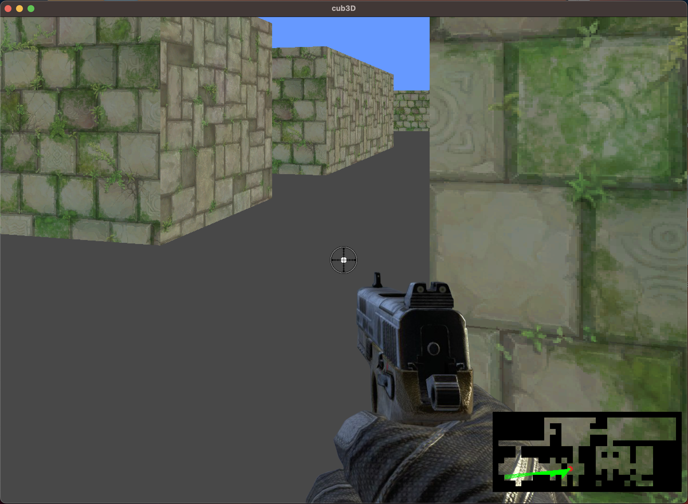

# cub3D

My first RayCaster with miniLibX

Summary: This project is inspired by the world-famous Wolfenstein 3D game, which
was the first FPS ever. It will enable you to explore ray-casting. Your goal will be to
make a dynamic view inside a maze, in which you’ll have to find your way.

Version: 10

